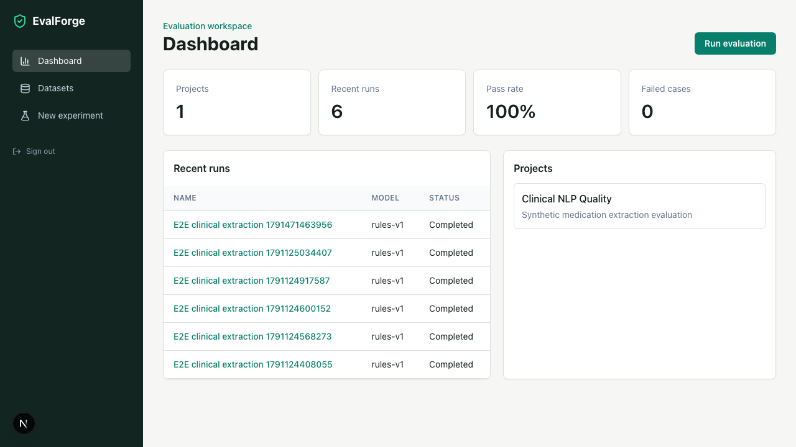
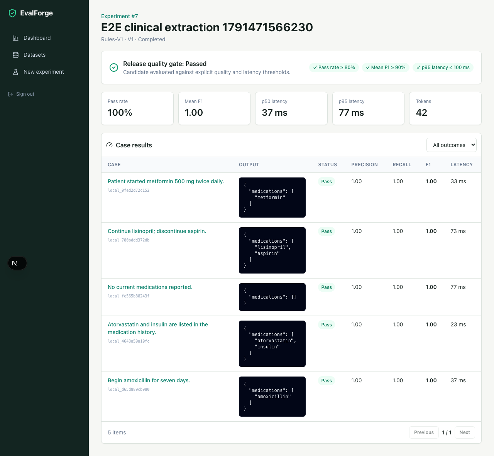
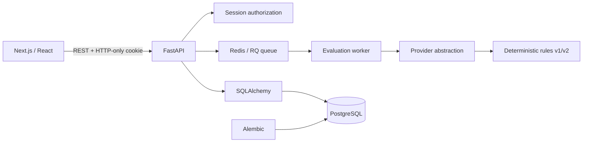

# EvalForge

[](https://github.com/Demianman/EvalForge/actions/workflows/ci.yml)

**AI regression testing that makes model and prompt changes reviewable.** EvalForge is a full-stack evaluation workspace for building test datasets, running reproducible evaluations, comparing candidate versions against a baseline, and recording human review decisions.

The bundled clinical entity extraction data is entirely synthetic. No proprietary code, patient data, or paid model API is required.

## Demo

1. Run `docker compose up --build`.
2. Open `http://localhost:3000`.
3. Sign in with `demo@evalforge.dev` / `demo1234`.

The container startup applies migrations and creates the demo user, project, dataset, and synthetic cases idempotently.

### Screenshots





## Engineering scope

- Next.js App Router, React, TypeScript, Tailwind, shadcn/ui-style Radix primitives, TanStack Query
- FastAPI, Pydantic validation, SQLAlchemy 2, Alembic, PostgreSQL
- Signed, HTTP-only, same-site local session authentication and per-owner authorization
- Dataset/test-case CRUD, search, filtering, pagination, validated CSV/JSON import
- Deterministic provider abstraction with two reproducible local model versions
- Pluggable provider contract with normalized request IDs, token usage, latency, and cost metadata
- Field-level precision/recall/F1 scoring plus schema and exact-match evaluation
- Automated release quality gate using pass-rate, F1, and p95 latency thresholds
- Redis-backed RQ worker with per-case progress, retry backoff, cancellation, and idempotent result creation
- Result metrics, baseline comparison, regression/improvement classification
- Optimistic human-review mutation with cache snapshot and rollback on API failure
- pytest API tests, Vitest + Testing Library components, lint/typecheck/build CI

## Architecture



TanStack Query owns server state: datasets, runs, result pages, metrics, and reviews. Component state is limited to ephemeral UI concerns such as selected rows, filters, form input, and pagination position. This keeps API cache invalidation explicit while avoiding a global client-state store with duplicated server data.

## Local development without Docker

Backend (SQLite is the development fallback):

```bash
cd backend
python -m venv .venv
source .venv/bin/activate
pip install -r requirements.txt
alembic upgrade head
python -m app.seed
uvicorn app.main:app --reload
```

Frontend:

```bash
cd frontend
npm install
npm run dev
```

## API overview

| Area | Endpoints |
|---|---|
| Auth | `POST /api/auth/login`, `POST /api/auth/logout`, `GET /api/auth/me` |
| Projects | `GET/POST /api/projects` |
| Datasets | `GET/POST/PUT/DELETE /api/datasets`, case CRUD, `/import` |
| Experiments | create/list/detail, paginated `/results`, `/compare` |
| Review | `GET /api/results/:id`, `PUT /api/results/:id/review` |

Errors use a consistent `{ "error": { "code", "message" } }` envelope. FastAPI also publishes interactive OpenAPI documentation at `http://localhost:8000/docs`.

### Typed API contract

FastAPI response models are the canonical contract. `backend/openapi.json` is exported from the running application schema, and `frontend/lib/api-schema.ts` is generated from it. Frontend domain aliases reference those generated components instead of duplicating response interfaces by hand.

```bash
cd frontend
npm run contracts:generate
```

CI regenerates both artifacts and fails when committed contracts have drifted from the backend models.

## Verification

```bash
cd backend && pytest
cd frontend && npm run test
cd frontend && npm run lint && npm run typecheck && npm run build
cd frontend && npx playwright install chromium && npm run test:e2e
```

The Playwright test starts isolated local backend/frontend servers and verifies the core sign-in → deterministic evaluation → results workflow in Chromium. GitHub Actions runs the same checks and validates that the Alembic migration applies to a clean database.

### CI release gate

After a run completes, the CLI prints a machine-readable report and exits non-zero if the run is incomplete or violates quality thresholds:

```bash
cd backend
python -m app.cli gate --run-id 42
```

## Decisions and tradeoffs

- **Deterministic first:** a rules provider keeps onboarding and CI free, stable, and offline. Its narrow scope is intentional; an OpenAI/Anthropic adapter can implement the same provider interface later.
- **Queue in Compose, synchronous tests:** Compose uses Redis and a dedicated RQ worker with retry backoff and cancellation. Tests use the same worker function synchronously, keeping CI deterministic without hiding queue boundaries.
- **Local session auth:** a signed, HTTP-only, same-site cookie demonstrates the auth boundary without forcing OAuth setup. Production deployment should add CSRF protection, session rotation/revocation, secure-cookie enforcement, and a managed identity provider.
- **Exact JSON scoring:** this makes pass/fail reproducible. Future evaluators can add schema-aware, semantic, RAG, and LLM-judge scoring.
- **Layered scoring:** exact match remains the release pass/fail signal while field-level precision, recall, and F1 explain partial extraction quality.

## Future work

Provider adapters and encrypted credentials, RBAC/workspaces, audit events, dataset and prompt versioning, accessibility audit, and deployment infrastructure remain future work.
